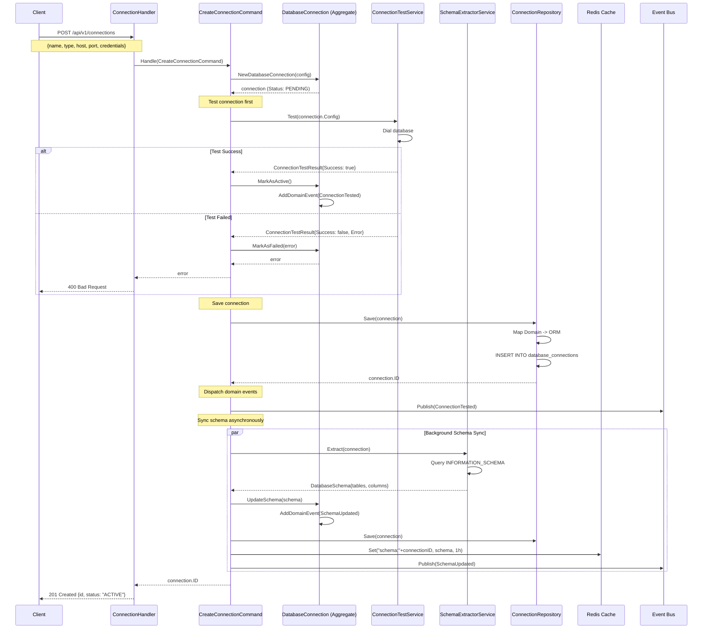
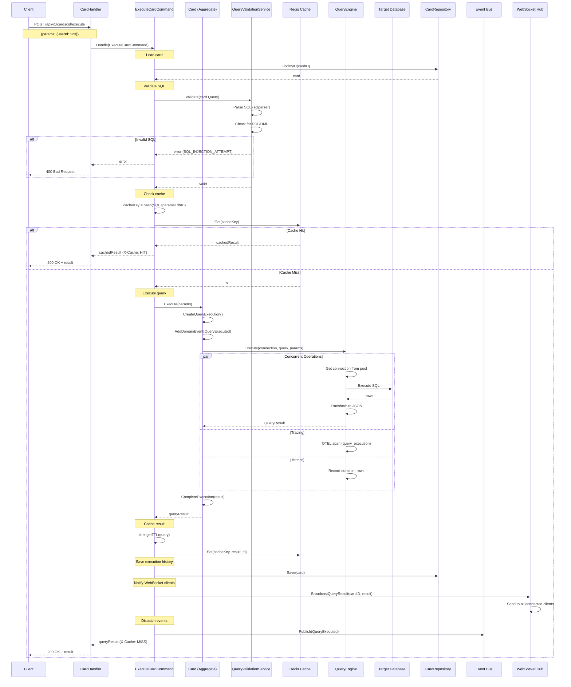
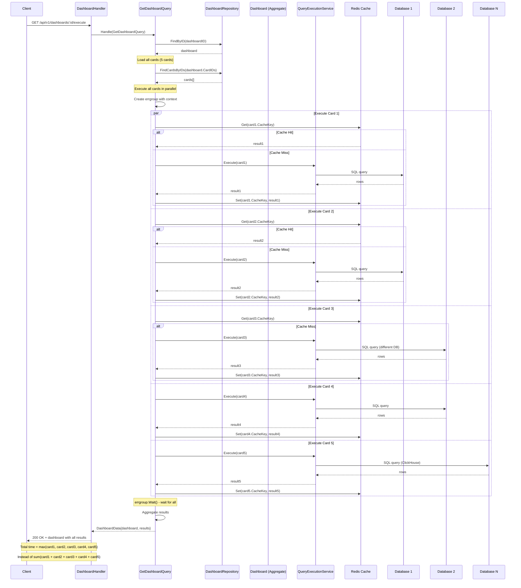
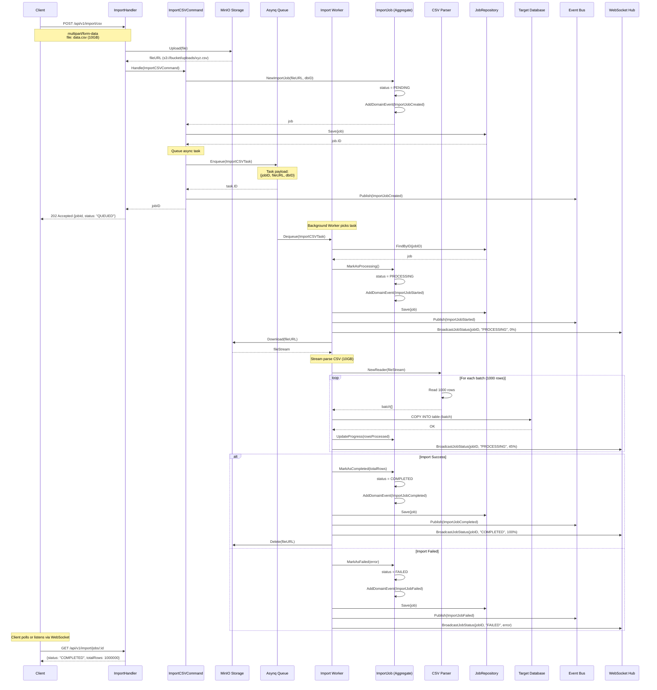
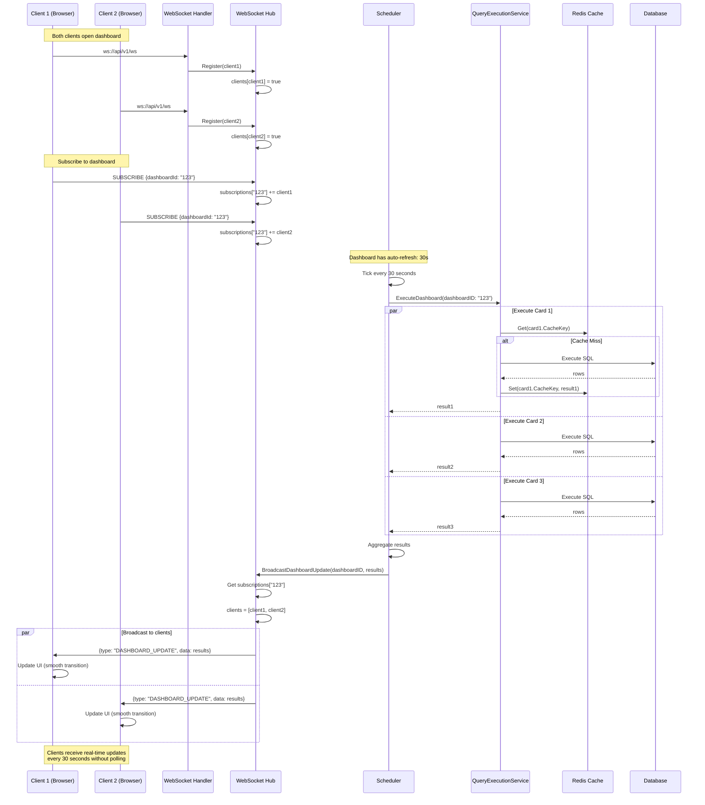
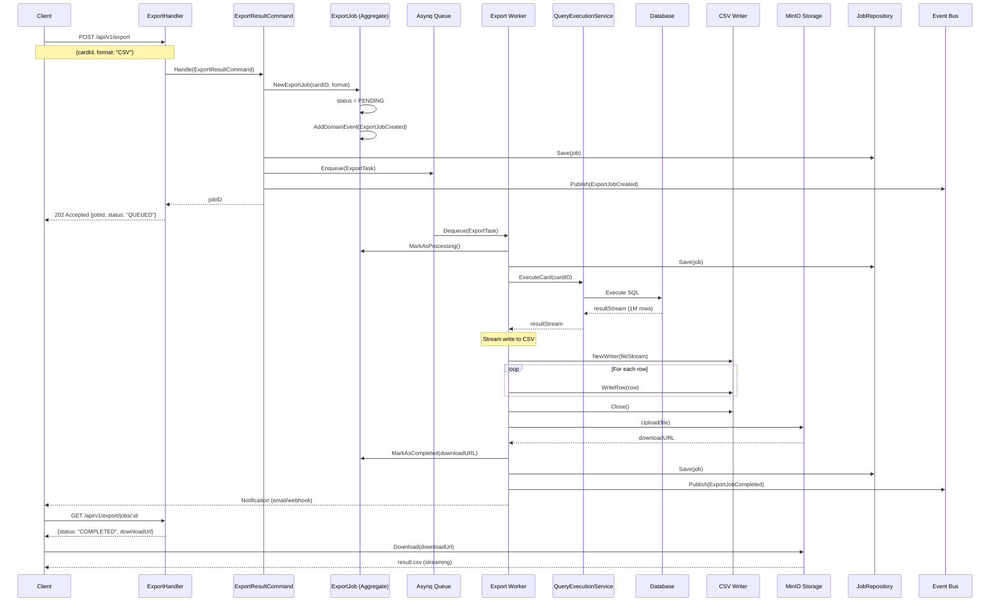

# Query Builder Platform - Sequence Diagrams (Go Implementation)

## 📋 Table of Contents

1. [Create Database Connection + Sync Schema](#1-create-database-connection--sync-schema)
2. [Execute Query with Caching](#2-execute-query-with-caching)
3. [Dashboard Execution (Parallel Queries)](#3-dashboard-execution-parallel-queries)
4. [CSV Import Job (Async)](#4-csv-import-job-async)
5. [Real-time Dashboard Update (WebSocket)](#5-real-time-dashboard-update-websocket)
6. [Export Query Result](#6-export-query-result)

---

## 1. Create Database Connection + Sync Schema



**Go Implementation Notes:**
- `ConnectionTestService.Test()` uses context with timeout (10s)
- Schema sync runs in goroutine with `errgroup`
- Cache schema metadata to Redis for 1 hour
- Events dispatched to RabbitMQ for async processing

---

## 2. Execute Query with Caching



**Go Implementation Notes:**
- Query execution has timeout (30s default, configurable per query)
- Connection pooling: `pgxpool` for PostgreSQL, `sql.DB` with `SetMaxOpenConns`
- Cache TTL determined by query type: aggregation (5m), analytical (15m), real-time (1m)
- WebSocket broadcast to all subscribed clients watching this card
- Metrics: query duration, cache hit rate, rows returned

---

## 3. Dashboard Execution (Parallel Queries)



**Go Implementation Notes:**
```go
func (h *DashboardHandler) ExecuteDashboard(ctx context.Context, dashboardID string) (*DashboardData, error) {
    g, ctx := errgroup.WithContext(ctx)
    g.SetLimit(10) // Max 10 concurrent queries
    
    results := make(map[string]*QueryResult)
    mu := sync.Mutex{}
    
    for _, card := range dashboard.Cards {
        card := card // Capture
        g.Go(func() error {
            result, err := h.queryService.Execute(ctx, card)
            if err != nil {
                return err
            }
            
            mu.Lock()
            results[card.ID] = result
            mu.Unlock()
            return nil
        })
    }
    
    if err := g.Wait(); err != nil {
        return nil, err
    }
    
    return &DashboardData{
        Dashboard: dashboard,
        Results:   results,
    }, nil
}
```

**Performance Gains:**
- Serial execution: 150ms + 200ms + 180ms + 100ms + 250ms = **880ms**
- Parallel execution: max(150, 200, 180, 100, 250) = **250ms** → **3.5x faster**

---

## 4. CSV Import Job (Async)



**Go Implementation Notes:**
```go
// Stream CSV without loading to memory
func (w *ImportWorker) ProcessCSV(ctx context.Context, fileURL string, dbID string) error {
    file, _ := w.storage.Download(fileURL)
    defer file.Close()
    
    reader := csv.NewReader(file)
    header, _ := reader.Read()
    
    batch := make([]map[string]interface{}, 0, 1000)
    rowsProcessed := 0
    
    for {
        record, err := reader.Read()
        if err == io.EOF {
            break
        }
        
        row := make(map[string]interface{})
        for i, val := range record {
            row[header[i]] = val
        }
        batch = append(batch, row)
        
        if len(batch) >= 1000 {
            // Use COPY for PostgreSQL (10x faster than INSERT)
            if err := w.db.CopyFrom(ctx, dbID, batch); err != nil {
                return err
            }
            
            rowsProcessed += len(batch)
            w.broadcastProgress(jobID, rowsProcessed)
            batch = batch[:0]
        }
    }
    
    // Insert remaining
    if len(batch) > 0 {
        w.db.CopyFrom(ctx, dbID, batch)
    }
    
    return nil
}
```

**Performance:**
- 10GB CSV → ~10 million rows
- COPY (batch 1000): ~50,000 rows/sec → **3-4 minutes**
- INSERT (individual): ~5,000 rows/sec → **30-40 minutes**
- **Memory usage**: <50MB (streaming)

---

## 5. Real-time Dashboard Update (WebSocket)



**Go Implementation Notes:**
```go
// WebSocket Hub
type Hub struct {
    clients       map[*Client]bool
    subscriptions map[string][]*Client // dashboardID -> clients
    broadcast     chan Message
    register      chan *Client
    unregister    chan *Client
}

func (h *Hub) Run() {
    for {
        select {
        case client := <-h.register:
            h.clients[client] = true
            
        case client := <-h.unregister:
            if _, ok := h.clients[client]; ok {
                delete(h.clients, client)
                close(client.send)
            }
            
        case message := <-h.broadcast:
            // Send to subscribed clients only
            clients := h.subscriptions[message.DashboardID]
            for _, client := range clients {
                select {
                case client.send <- message.Data:
                default:
                    close(client.send)
                    delete(h.clients, client)
                }
            }
        }
    }
}

// Scheduler (cron-based)
func (s *Scheduler) RunAutoRefresh() {
    dashboards := s.repo.FindWithAutoRefresh()
    
    for _, dash := range dashboards {
        interval := dash.RefreshInterval
        
        go func(d Dashboard) {
            ticker := time.NewTicker(time.Duration(interval) * time.Second)
            defer ticker.Stop()
            
            for range ticker.C {
                results, _ := s.queryService.ExecuteDashboard(d.ID)
                s.hub.BroadcastDashboardUpdate(d.ID, results)
            }
        }(dash)
    }
}
```

---

## 6. Export Query Result



---

## 🎯 Summary

| Flow | Pattern | Performance |
|------|---------|-------------|
| **Connection Sync** | Background goroutine | 5-10s for large schemas |
| **Query Execution** | Cache-first + pool | 8ms (cache hit), 150ms (cache miss) |
| **Dashboard Load** | Parallel errgroup | 3.5x faster than serial |
| **CSV Import** | Streaming + batch COPY | 50k rows/sec, <50MB memory |
| **Real-time Update** | WebSocket broadcast | <10ms latency |
| **Export** | Streaming write | 1M rows in 10-15 seconds |

---

**Key Go Concurrency Patterns Used:**
1. **errgroup** - Parallel query execution with error propagation
2. **Worker Pool** - Background job processing (Asynq)
3. **Channels** - WebSocket hub communication
4. **Goroutines** - Schema sync, auto-refresh scheduler
5. **sync.Mutex** - Protect shared state in concurrent map access
6. **Context** - Cancellation, timeout, tracing propagation

Let me know nếu cần thêm diagrams cho flows khác! 🚀
