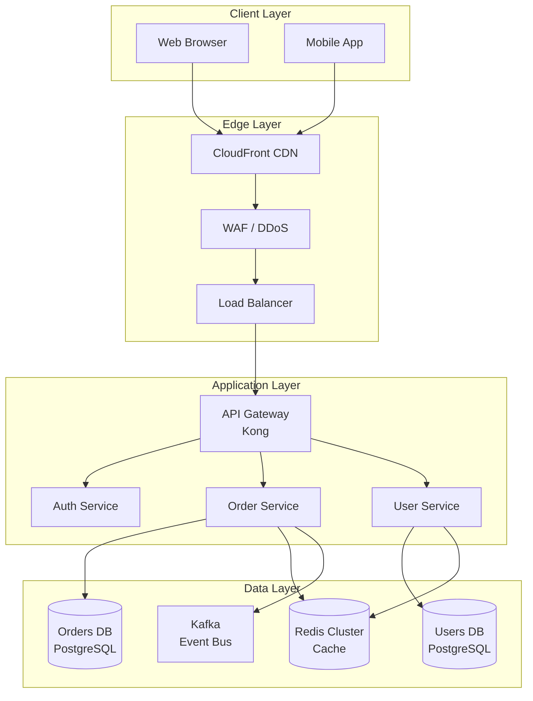
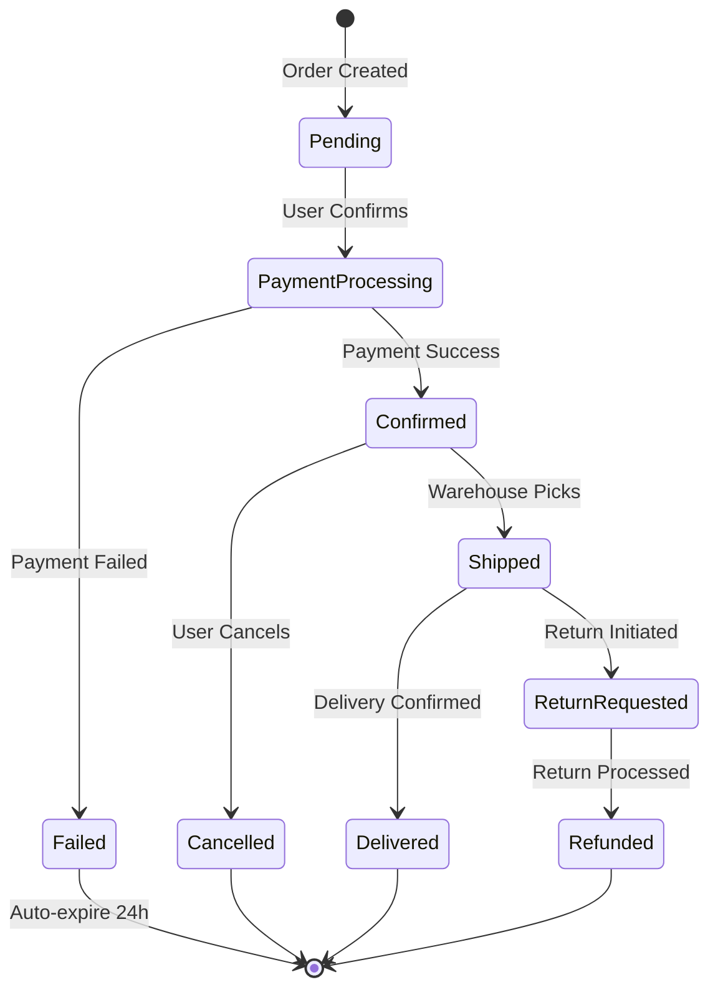
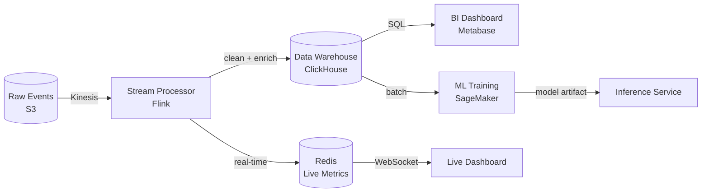
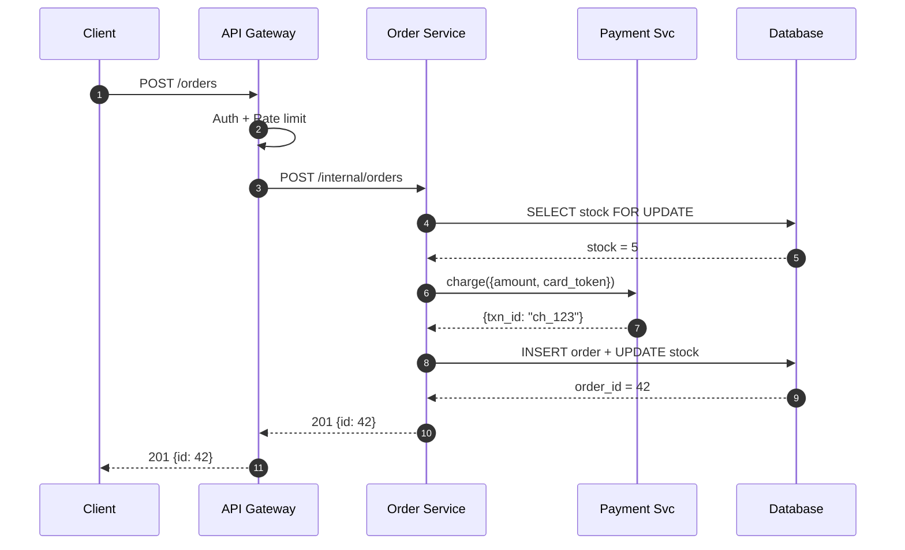

# Diagram Guide — Audience-First System

## Nguyên tắc số 1: Diagram phục vụ audience, không phục vụ author

Trước khi vẽ, trả lời:
1. **Who**: Ai đọc diagram này? (CEO, Engineer, On-call, New hire)
2. **Why**: Họ cần hiểu gì? (Approve budget? Debug prod? Onboard?)
3. **When**: Họ nhìn vào khi nào? (Meeting? 3 AM incident? Code review?)

```
Audience → CEO/Manager      → High-level topology, no technical details
Audience → Senior Engineer  → Component detail, data flow, failure modes
Audience → On-call          → Request flow, failure points, escalation
Audience → New hire         → How the system works, how pieces connect
Audience → External partner → API boundaries, integration points only
```

---

## Diagram Type Decision Tree

```
Muốn show cái gì?
│
├── Toàn bộ hệ thống / các services
│   ├── Deployment + infrastructure → Architecture Diagram (C4 System Context)
│   └── Services + dependencies → Component Diagram (C4 Container)
│
├── Luồng request / data
│   ├── Request qua nhiều services → Sequence Diagram
│   ├── Data pipeline / processing → Flowchart / Data Flow Diagram
│   └── Realtime events → Event Flow / Message Flow
│
├── Database / data model
│   ├── Schema relationships → ER Diagram
│   └── Data transformation → Data Flow Diagram
│
├── Process / logic
│   ├── Decision logic → Flowchart
│   ├── State transitions → State Machine Diagram
│   └── Concurrent processes → Sequence / Activity
│
├── Infrastructure / deployment
│   ├── Cloud resources → Infrastructure Diagram
│   └── Network topology → Network Diagram
│
└── Algorithm / time-based
    ├── Step-by-step algorithm → ASCII trace (R6 rules)
    └── Timeline / concurrent execution → Timeline Diagram
```

---

## C4 Model — 4 Levels of Architecture Diagrams

C4 là standard được Big Tech adopt rộng rãi (Amazon, Google...).

### Level 1: System Context

Ai tương tác với system, từ bên ngoài nhìn vào.

```
Format: ASCII hoặc simple boxes

┌──────────────────────────────────────────────────────────┐
│                      System Context                       │
└──────────────────────────────────────────────────────────┘

    [Mobile App]          [Web Browser]
         │                      │
         └──────────┬───────────┘
                    │ HTTPS
                    ▼
          ┌─────────────────┐
          │   E-Commerce    │   ← System being designed
          │    Platform     │
          └────────┬────────┘
          │        │        │
          ▼        ▼        ▼
    [Payment    [Email   [Analytics
     Gateway]   Service]  Platform]
    (Stripe)    (SES)    (Segment)

*Hình: External actors và external systems — không detail internal components.*
```

### Level 2: Container (Services/Deployables)

Bên trong system có gì — deployable units.

```
┌─────────────────────────────────────────────────────────┐
│                   E-Commerce Platform                    │
│                                                          │
│  [Web App]         [API Gateway]        [Admin Panel]   │
│  React/Next.js  ──►  Kong/nginx  ◄────  React           │
│                         │                               │
│              ┌──────────┼──────────┐                   │
│              ▼          ▼          ▼                   │
│         [Order      [User       [Product               │
│          Service]   Service]    Service]                │
│         Go/gRPC    Go/gRPC     Go/gRPC                  │
│              │          │          │                   │
│              └──────────┼──────────┘                   │
│                         │                               │
│              ┌──────────┼──────────┐                   │
│              ▼          ▼          ▼                   │
│         [Orders DB] [Users DB] [Products DB]           │
│         PostgreSQL  PostgreSQL  PostgreSQL              │
│                                                          │
│                    [Kafka]                              │
│                   Event Bus                             │
└─────────────────────────────────────────────────────────┘

*Hình: Internal deployable units và communication patterns — language/tech visible.*
```

### Level 3: Component (Internal structure của 1 container)

Deep-dive vào 1 service.

```
┌──────────────────────────────────────────┐
│              Order Service               │
│                                          │
│  [gRPC Handler] → [Order Use Cases]     │
│                        │                 │
│              ┌─────────┼──────────┐     │
│              ▼         ▼          ▼     │
│       [Order Repo] [Payment  [Notif     │
│                    Client]  Publisher]  │
│              │                   │      │
│              ▼                   ▼      │
│       [PostgreSQL]           [Kafka]    │
└──────────────────────────────────────────┘
```

### Level 4: Code (Class/Function level)

Hiếm dùng trong system design — dành cho detailed design doc.

---

## Sequence Diagram Templates

### HTTP Request Flow

```
Client          API Gateway        Order Service       Payment Svc        DB
  │                  │                   │                  │               │
  ├─ POST /orders ──►│                   │                  │               │
  │   + JWT token    │                   │                  │               │
  │                  ├─ validate token   │                  │               │
  │                  ├─ rate limit check │                  │               │
  │                  ├─ POST /orders ───►│                  │               │
  │                  │    (internal)     │                  │               │
  │                  │                  ├─ validate items   │               │
  │                  │                  ├─ reserve stock ──────────────────►│
  │                  │                  │◄─ stock reserved ─────────────────┤
  │                  │                  ├─ charge payment ─►│               │
  │                  │                  │◄─ payment OK ─────┤               │
  │                  │                  ├─ create order ───────────────────►│
  │                  │                  │◄─ order_id=42 ─────────────────────┤
  │                  │◄─ 201 {id: 42} ──┤                  │               │
  │◄─ 201 {id: 42} ──┤                  │                  │               │
  │                  │                  │                  │               │

*Hình: Happy path order creation — chú ý synchronous payment call là potential SLA risk.*
```

### Async Event Flow

```
Producer Svc      Kafka          Consumer A        Consumer B
    │               │                │                  │
    ├─ publish ────►│                │                  │
    │  OrderCreated │                │                  │
    │               ├─ push ────────►│                  │
    │               │  (send email)  │                  │
    │               ├─ push ──────────────────────────►│
    │               │                │  (update analytics)
    │               │                │                  │
    │               │  [offset committed]               │
    │               │◄───────────────┤                  │
    │               │  [offset committed]               │
    │               │◄──────────────────────────────────┤

*Hình: Fan-out pattern — Order event consumed independently by email và analytics.*
```

### Failure & Retry Flow

```
Client          Service A          Service B
  │                │                   │
  ├─ request ─────►│                   │
  │                ├─ call ───────────►│
  │                │               [timeout 5s]
  │                │◄─ timeout ────────┤
  │                │                   │
  │                ├─ retry (attempt 2)►│
  │                │◄─ 503 ────────────┤
  │                │   [circuit open]  │
  │                │                   │
  │                ├─ fallback response│
  │◄─ 200 degraded ┤  (cached/default) │
  │                │                   │

*Hình: Circuit breaker behavior — sau 2 failures, Service A serves degraded response
 thay vì block client thread. Service B được spared từ thundering herd on recovery.*
```

---

## Mermaid Templates — Production-ready

### Architecture Overview



### State Machine



### Data Flow



### Sequence (Mermaid)



---

## Infrastructure Diagrams

### Multi-AZ Deployment

```
Region: us-east-1
┌────────────────────────────────────────────────────────────┐
│                                                            │
│  AZ-1a                  AZ-1b                  AZ-1c      │
│  ┌──────────────┐       ┌──────────────┐                  │
│  │ App Server 1 │       │ App Server 2 │  ...             │
│  └──────┬───────┘       └──────┬───────┘                  │
│         │                      │                           │
│  ┌──────▼──────────────────────▼──────┐                   │
│  │         Internal Load Balancer      │                   │
│  └─────────────────┬───────────────────┘                  │
│                    │                                        │
│  ┌─────────────────▼───────────────────┐                  │
│  │  RDS PostgreSQL (Multi-AZ)           │                  │
│  │  Primary (AZ-1a) ──sync──► Standby  │                  │
│  │                             (AZ-1b) │                  │
│  └─────────────────────────────────────┘                  │
│                    │                                        │
│  ┌─────────────────▼───────────────────┐                  │
│  │  ElastiCache Redis Cluster           │                  │
│  │  Primary (AZ-1a) ──async──► Replica │                  │
│  └─────────────────────────────────────┘                  │
└────────────────────────────────────────────────────────────┘

*Hình: Multi-AZ setup với RDS failover automatic — RTO ~60s, RPO near-zero.*
```

### Microservices với Service Mesh

```
┌──────────────────────────────────────────────────────┐
│                  Kubernetes Cluster                   │
│                                                       │
│  ┌─────────────────────────────────────────────────┐ │
│  │              Istio Service Mesh                  │ │
│  │                                                  │ │
│  │  ┌──────────┐    ┌──────────┐   ┌──────────┐   │ │
│  │  │  Order   │    │  User    │   │ Product  │   │ │
│  │  │ Service  │◄──►│ Service  │◄─►│ Service  │   │ │
│  │  │ [envoy]  │    │ [envoy]  │   │ [envoy]  │   │ │
│  │  └──────────┘    └──────────┘   └──────────┘   │ │
│  │        ↕ mTLS everywhere             ↕          │ │
│  │  Circuit break / retry / timeout: automatic     │ │
│  └─────────────────────────────────────────────────┘ │
│                                                       │
│  ┌──────────┐  ┌──────────┐  ┌──────────────────┐   │
│  │ Prometheus│  │  Jaeger  │  │    Kiali          │   │
│  │ Grafana  │  │ Tracing  │  │  Mesh Dashboard   │   │
│  └──────────┘  └──────────┘  └──────────────────┘   │
└──────────────────────────────────────────────────────┘

*Hình: Service mesh handles cross-cutting concerns (mTLS, retry, circuit break)
 at infrastructure layer — application code stays clean.*
```

---

## Diagram Anti-Patterns — What Big Tech Avoids

```
❌ "God diagram" — everything in one diagram
   Fix: Use C4 levels, separate diagrams per audience

❌ Lines without labels — arrows không nói gì về protocol/data
   Fix: Label every connection (HTTPS, gRPC, async event, SQL)

❌ Technology-first naming — "Kafka box" without explaining why
   Fix: Name by responsibility ("Event Bus") + tech in subtitle

❌ Missing failure modes — chỉ vẽ happy path
   Fix: Add dashed lines for async/fallback, note failure scenarios in caption

❌ No scale context — diagram không cho biết load
   Fix: Annotate với numbers ("10K QPS", "1TB/day", "1M users")

❌ Stale diagram — drawn once, never updated
   Fix: Diagram-as-code (Mermaid, PlantUML) checked into git, PR required to update

❌ Inconsistent notation — squares, circles, clouds mixed without legend
   Fix: Define legend, use consistent shapes (rectangle = service, cylinder = DB)
```

---

## Caption Standards cho System Diagrams

Caption phải trả lời: **"Điều gì không hiển nhiên từ diagram?"**

```
❌ "Hình: Kiến trúc hệ thống e-commerce"  ← không thêm gì

✅ "Hình: Order Service dùng synchronous payment call trong critical path —
    nếu Payment Svc P99 = 500ms, Order create P99 ≥ 500ms.
    Candidate cho async migration khi scale > 5K TPS."

✅ "Hình: Multi-AZ deployment với RDS automatic failover.
    AZ failure → ~60s RTO, near-zero RPO. Region failure không được cover —
    xem DR runbook cho cross-region failover procedure."

✅ "Hình: Fan-out pattern cho order events — Email và Analytics consume
    independently, Order Service không biết về downstream consumers.
    Thêm consumer mới: không cần change Order Service code."
```
