# Data Visualizer Agent Team

Thư mục này chứa các định nghĩa và tài liệu thiết kế đặc tả cho đội ngũ AI Agents (13 Agents) của dự án Data Visualizer.

Dựa trên cấu trúc từ `DV-TEAM.md`, `DV-ORCHESTRATOR.md` và `AGENT-INTERACTION-PROTOCOL.md`, team hoạt động theo mô hình quản lý tập trung và vận hành phân tán.

Trong đó, **Mission Commander (Người dùng)** ở vị trí cao nhất, điều khiển toàn bộ quá trình thông qua **DV-ORCHESTRATOR** (Trưởng nhóm Điều phối). Các Agent còn lại đóng vai trò như các chuyên viên được chia thành 5 nhóm nghiệp vụ chính tương ứng với các giai đoạn trong **SDLC Flow**.

---

## 1. Sơ đồ Tổ chức Nhân sự Phân cấp (Organizational Chart)

```mermaid
graph TD
    MC[Mission Commander<br/>👤 Người dùng / Quyết định cuối cùng] --> ORC[DV-ORCHESTRATOR<br/>🧠 Trưởng nhóm Điều phối / Quản lý dự án]

    ORC --> PA[Nhóm Phân tích & Kiến trúc<br/>Product & Architecture]
    ORC --> DEV[Nhóm Phát triển<br/>Development]
    ORC --> QA[Nhóm Chất lượng & Tối ưu<br/>Quality & Optimization]
    ORC --> OPS[Nhóm Vận hành & Tài liệu<br/>Operations & Documentation]
    ORC --> DA[Nhóm Dữ liệu & Analytics<br/>Data & Analytics]

    %% Phân tích & Kiến trúc
    PA --> DPA[dv-product-analyst<br/>📋 Chuyên viên Phân tích Sản phẩm]
    PA --> DVA[dv-architect<br/>🏛️ Kiến trúc sư Hệ thống]
    PA --> DUXA[dv-ui-ux-architect<br/>🎨 Kiến trúc sư UI/UX<br/>Design system, UX flows, specs]

    %% Phát triển
    DEV --> DTW[dv-test-writer<br/>🧪 Chuyên viên Kiểm thử TDD]
    DEV --> DBED[dv-backend-developer<br/>⚙️ Lập trình viên Backend NestJS DDD]
    DEV --> DFED[dv-frontend-developer<br/>🖥️ Lập trình viên Frontend React/Next.js]

    %% Quality & Optimization
    QA --> DBO[dv-db-optimizer<br/>🗄️ Chuyên gia Cơ sở dữ liệu]
    QA --> DCR[dv-code-reviewer<br/>🔍 Chuyên viên Review Code]
    QA --> DBG[dv-debugger<br/>🐛 Chuyên gia Trị lỗi]
    QA --> DRS[dv-refactor-specialist<br/>🔧 Chuyên gia Tái cấu trúc]

    %% Operations & Documentation (NEW)
    OPS --> DDOPS[dv-devops-engineer<br/>🚀 Kỹ sư DevOps<br/>Docker/CI-CD/K8s/ArgoCD/Istio]
    OPS --> DDTW[dv-technical-writer<br/>📚 Chuyên viên Tài liệu<br/>API docs/CHANGELOG/Onboarding]

    %% Data & Analytics
    DA --> DDA[dv-data-analyst<br/>📊 Chuyên viên Dữ liệu]

    %% Style
    classDef commander fill:#ffcccc,stroke:#990000,stroke-width:2px,color:#990000,font-weight:bold;
    classDef lead fill:#cce5ff,stroke:#004085,stroke-width:2px,color:#004085,font-weight:bold;
    classDef group fill:#f8f9fa,stroke:#6c757d,stroke-width:2px,stroke-dasharray: 5 5,color:#495057,font-weight:bold;
    classDef agent fill:#d4edda,stroke:#155724,stroke-width:1px,color:#155724;
    classDef newagent fill:#fff3cd,stroke:#856404,stroke-width:2px,color:#856404,font-weight:bold;

    class MC commander;
    class ORC lead;
    class PA,DEV,QA,DA,OPS group;
    class DPA,DVA,DTW,DBED,DFED,DBO,DCR,DBG,DRS,DDA agent;
    class DUXA,DDOPS,DDTW newagent;
```



---

## 2. Sơ đồ Luồng Giao tiếp và Thực thi SDLC (Interaction & Execution Flow)

Bên cạnh cấu trúc phân cấp, quy trình làm việc (Workflow) tuân theo **SDLC Flow** và **Agent Interaction Protocol** diễn ra như sau:

```mermaid
graph TD
    classDef commander fill:#ffcccc,stroke:#990000,stroke-width:2px;
    classDef orchestrator fill:#cce5ff,stroke:#004085,stroke-width:2px;
    classDef action fill:#fff3cd,stroke:#856404,stroke-width:1px;
    classDef newagent fill:#fff3cd,stroke:#856404,stroke-width:2px;

    MC([Mission Commander<br/>Người dùng]) ::: commander
    ORC{DV-ORCHESTRATOR<br/>Lên YAML Plan} ::: orchestrator

    %% Input phase
    MC -->|Yêu cầu tính năng mới| PA(0. dv-product-analyst<br/>Viết Feature Spec/AC)
    MC -->|Tính năng lớn/Khó| ARC(1. dv-architect<br/>Ra quyết định kiến trúc/ADR)
    MC -->|Cần thiết kế UI/UX| UXARC(1.5. dv-ui-ux-architect<br/>Design system, UX flows, specs) ::: newagent
    MC -.->|Giao Task trực tiếp| ORC

    PA -->|YAML / Docs| ORC
    ARC -->|ADR Docs| ORC
    UXARC -->|Design Specs| ORC

    %% Execution Phase
    ORC -->|1. Viết Test trước| TDD(3. dv-test-writer<br/>TDD - RED Phase)

    TDD -->|2. Có test framework| BE(4. dv-backend-developer<br/>Implement Backend)
    TDD -->|2. Có test framework| FE(5. dv-frontend-developer<br/>Implement Frontend)
    BE -.->|Tính năng AI| BE_AI(9. dv-backend-developer<br/>AI Integration)

    BE & FE -->|3. Tối ưu nếu cần| OPT(6. dv-db-optimizer)
    OPT -->|4. Code xong| REV(7. dv-code-reviewer<br/>Đánh giá toàn diện)

    %% Feedback Loop
    REV -->|Từ chối - Bug| DBG(8a. dv-debugger<br/>Fix lỗi) ::: action
    REV -->|Từ chối - Code rác| REF(8b. dv-refactor-specialist<br/>Dọn dẹp) ::: action
    DBG & REF -.-> REV

    %% Post Deployment
    REV -->|Approved & Live| DTA(10. dv-data-analyst<br/>Theo dõi KPIs sau live)
    DTA -->|Infrastructure/Deploy| DEVOPS(11. dv-devops-engineer<br/>CI-CD, Docker, K8s, ArgoCD) ::: newagent
    DEVOPS -->|Sau mỗi feature merge| DOCWR(12. dv-technical-writer<br/>API docs, CHANGELOG, Onboarding) ::: newagent

    %% Interaction Rule
    Blocker[❗ LƯU Ý PHÂN CẤP:<br/>Mọi Agent BẮT BUỘC PAUSE & HỎI lại Mission Commander<br/>nếu thiếu spec, lỗi logic hoặc thay đổi kiến trúc lớn.]:::action
```

---

## 3. Diễn giải thêm về phân cấp & quyền hạn

1. **Mission Commander (Người Dùng) - Cấp Quyết Định:**
    - Quyết định xử lý conflict khi 2 Agent không đồng nhất.
    - Thẩm định Scope, Requirement và quyết định Kiến trúc.
    - Là điểm chốt "Escalation" (dừng lại và hỏi) theo `AGENT-INTERACTION-PROTOCOL.md`.

2. **DV-ORCHESTRATOR - Cấp Quản Lý/Điều Phối:**
    - Liên tục check `progress.md` và `CHANGELOG.md` để lên execution plan (YAML).
    - Không tự sinh code, chỉ đóng vai trò phân chia ticket/task cho đội ngũ bên dưới.

3. **Các Agent Chuyên Viên (Lập trình/Phân tích/Review) - Cấp Thực Thi:**
    - Được phân chia nhiệm vụ rõ ràng và được cung cấp `skills` cụ thể (như `security-review`, `jira` skill).
    - Không Agent nào thay thế chức năng của Agent nào (VD: _Backend Dev_ không lấn quyền _DB Optimizer_ khi xử lý query siêu chậm; _Product Analyst_ KHÔNG viết code).
    - Dưới nguyên tắc "Security by Default", các action liên quan tới bảo mật/kiến trúc của developers sẽ luôn được kiểm tra chéo (cross-check) bởi Code Reviewer và các quy tắc từ Architect.

4. **Nhóm Vận hành & Tài liệu (NEW) — 2 Agents:**
   - `dv-devops-engineer`: Infrastructure automation — Docker, GitHub Actions, GitLab CI, ArgoCD, Helm, K8s, Istio, Terraform. Dispatched for any infrastructure, deployment, or CI/CD task.
   - `dv-technical-writer`: Documentation specialist — API docs, CHANGELOG maintenance, module docs, onboarding guides. Dispatched after every feature merge and for any doc-related task.
