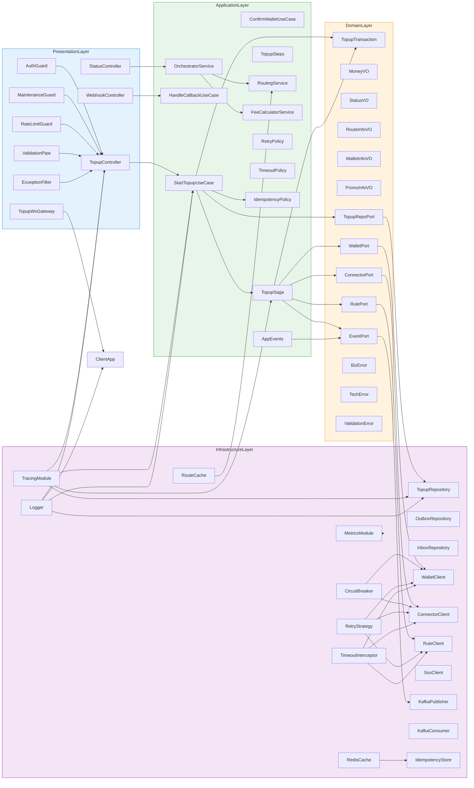

# Class Classification

```mermaid
flowchart LR
subgraph PresentationLayer
direction TB
TopupController
StatusController
WebhookController
TopupWsGateway
AuthGuard
MaintenanceGuard
RateLimitGuard
ValidationPipe
ExceptionFilter
end
subgraph ApplicationLayer
direction TB
StartTopupUseCase
HandleCallbackUseCase
ConfirmWalletUseCase
TopupSaga
TopupSteps
OrchestratorService
RoutingService
FeeCalculatorService
RetryPolicy
TimeoutPolicy
IdempotencyPolicy
AppEvents
end
subgraph DomainLayer
direction TB
TopupTransaction
MoneyVO
StatusVO
RouteInfoVO
WalletInfoVO
PromoInfoVO
TopupRepoPort
WalletPort
ConnectorPort
RulePort
EventPort
BizError
TechError
ValidationError
end
subgraph InfrastructureLayer
direction TB
TopupRepository
OutboxRepository
InboxRepository
WalletClient
ConnectorClient
RuleClient
SsoClient
KafkaPublisher
KafkaConsumer
CircuitBreaker
RetryStrategy
TimeoutInterceptor
RedisCache
RouteCache
IdempotencyStore
TracingModule
MetricsModule
Logger
end

ClientApp

%% Presentation -> Application
TopupController --> StartTopupUseCase
StatusController --> OrchestratorService
WebhookController --> HandleCallbackUseCase
TopupWsGateway --> ClientApp

AuthGuard --> TopupController
MaintenanceGuard --> TopupController
RateLimitGuard --> TopupController
ValidationPipe --> TopupController
ExceptionFilter --> TopupController

%% Application -> Domain
StartTopupUseCase --> TopupTransaction
StartTopupUseCase --> TopupRepoPort
StartTopupUseCase --> TopupSaga
StartTopupUseCase --> IdempotencyPolicy
OrchestratorService --> RoutingService
OrchestratorService --> FeeCalculatorService

TopupSaga --> TopupTransaction
TopupSaga --> WalletPort
TopupSaga --> ConnectorPort
TopupSaga --> RulePort
TopupSaga --> EventPort

AppEvents --> EventPort

%% Domain Ports -> Infrastructure
TopupRepoPort --> TopupRepository
WalletPort --> WalletClient
ConnectorPort --> ConnectorClient
RulePort --> RuleClient
EventPort --> KafkaPublisher

%% Infra cross-cutting
RedisCache --> IdempotencyStore
RouteCache --> RoutingService

CircuitBreaker --> WalletClient
CircuitBreaker --> ConnectorClient

RetryStrategy --> WalletClient
RetryStrategy --> ConnectorClient
RetryStrategy --> RuleClient

TimeoutInterceptor --> WalletClient
TimeoutInterceptor --> ConnectorClient
TimeoutInterceptor --> RuleClient

TracingModule --> TopupController
TracingModule --> StartTopupUseCase
TracingModule --> TopupSaga
TracingModule --> TopupRepository

MetricsModule --> InfrastructureLayer
Logger --> ClientApp
Logger --> TopupController
Logger --> StartTopupUseCase
Logger --> TopupRepository

%% Layer background colors (mỗi layer một màu)
style PresentationLayer fill:#e3f2fd,stroke:#1e88e5,stroke-width:1px
style ApplicationLayer fill:#e8f5e9,stroke:#43a047,stroke-width:1px
style DomainLayer fill:#fff3e0,stroke:#fb8c00,stroke-width:1px
style InfrastructureLayer fill:#f3e5f5,stroke:#8e24aa,stroke-width:1px
```
