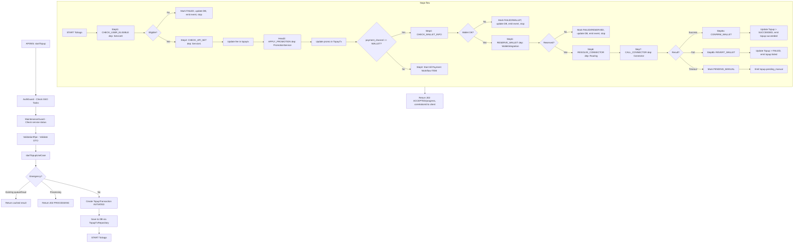

Flow diagram này mô tả quy trình xử lý topup với các bước chính:

* Authentication và validation
* Kiểm tra trường hợp emergency
* Tạo transaction và lưu vào database
* Xử lý saga flow với nhiều bước kiểm tra user, API, promotion, wallet và connector
* Xử lý kết quả cuối cùng (success/fail/timeout)
